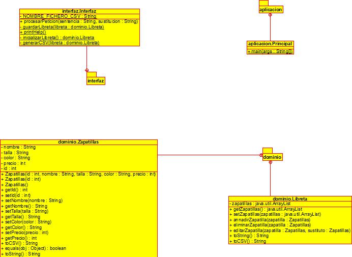

# Catalogo de Zapatillas:

## Autores:

> - **Carlos Moragon.**
> - **Juan F. Gracia.**
> - **Orianna Milone.**
> - **Pablo Torres.**

# Descripción 
Se presenta una lista de Zapatillas. Con la cual el usuario puede interactuar, al agregar contenido al catalogo, modificar/leer y/o eliminar informacion del mismo. 

# Menú de opciones:
  >*'add'* (Para añadir una modelo de zapatillas).
	Debera especificar: Id (numero de identificacion), Nombre, Talla, Color, Precio.

  >*'delete'* (Para eliminar un modelo de zapatilla).
        Debera especificar: Id (numero de identificacion), Nombre, Talla, Color, Precio.

  >*'edit'* (Para modificar un modelo de zapatillas).
        Debera especificar: Id (numero de identificacion), Nombre, Talla, Color, Precio.

  >*'list'* (Mostrar las zaptillas del catalogo).

  >*'help'*

  >*'exit'*
## El prodcuto: 
El catalogo ofrece una colección de zapatillas, donde incluye sus:
 > Numero de identificación (id).

 > Nombre.

 > Talla.

 > Color.

 > Precio.

## Ejemplo (previsualización)

*Make ejecutar*
> - add 14 Jordan 37 azul 120
> - list

----------------------------------------------
     Id |  Nombre  | Talla |  Color | Precio

     14 |  Jordan  |  37   |  azul  |  120 

----------------------------------------------

> - exit

### Cuenta con 4 clases que permiten interactuar con la informacion:
> - Principal: Ejecutara el programa.
> - Interfaz: Procesa las peticiones, para escribir, leer, borrar o modificar informacion en el catalago.
> - Libreta: Traduce la informacion para el catalogo.
> - Zapatillaz: Contiene los atributos/características del producto.

## Licencias
Copyright [2021] [Carlos Moragon, Pablo Torres, Juan Garcia, Orianna Milone]

Licensed under the Apache License, Version 2.0 (the "License");
you may not use this file except in compliance with the License.
You may obtain a copy of the License at

        http://www.apache.org/licenses/LICENSE-2.0

        Unless required by applicable law or agreed to in writing, software
        distributed under the License is distributed on an "AS IS" BASIS,
        WITHOUT WARRANTIES OR CONDITIONS OF ANY KIND, either express or implied.
        See the License for the specific language governing permissions and
        limitations under the License.

## Diagrama de programa

